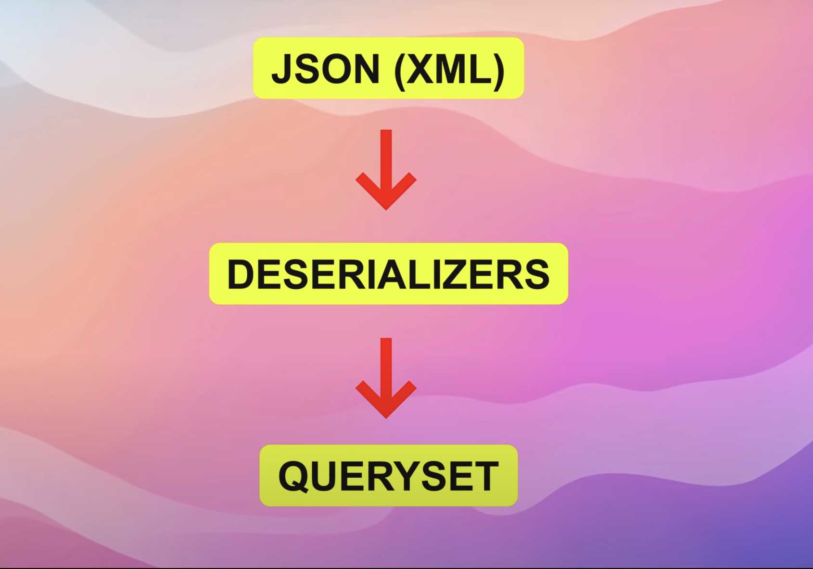

# Django-Rest-Framework

### What is API

- API : Application Programming Interface

- It acts as a two-way communication bridge between Frontend and Backend.

### REST API

- Representational State Transfer

- It organizes how web applications talk to each other, separating what the user sees(frontend) from what runs behind the scenes(backend).

### Core principles of REST :

- Stateless : Server doesn't store any information about the client between the request cycles.

- Client-Server architecture

- Standerdized interface : REST API's rely on a set of standard methods (GET, POST, PUT, DELETE) for interacting with resources.

- Easy to read the data.

### Installation :

Before start working with Django Rest Framework, we need to have a Django project ready upfront.

Step 1 : Create a folder for your project

Step 2 : Navigate into that folder and create a virtual environment.
```py
python3 -m venv .venv
```

Step 3 : Activate the virtual environment.
```py
source .venv/bin/activate
```

NOTE : Do 'pip freeze' before and after activating the virtual environment.

Step 4 : Install Django inside your project :
```py
python -m pip install Django
```

Step 5 : Then, run the following command to bootstrap a new Django project:
```py
django-admin startproject <project_name>

# OR 

django-admin startproject <project_name> .
```

Step 6 : Run the project
```py
python manage.py runserver
```

Step 7 : Django Rest Framework installation
```py
pip install djangorestframework
```

Step 8 : Add `rest_framework` to your INSTALLED_APPS setting.
```py
INSTALLED_APPS = [
    ...
    'rest_framework',
]
```

### Types of Url Endpoints :

1. **Web Application Endpoints** - Users can directly access it from the web browser. This can be created using core Django framework

Example : http://127.0.0.1:8000/students/

2. **API Endpoint** : Returns the data to integrate into the frontend. This can be created using Django REST Framework.

Example : http://127.0.0.1:8000/v1/students/

### Serialization : 

- It's the process of converting the model object or query set into JSON format or any other formats that the client requires.

- Serializers = Translators for your data

- For example, you have a book written in English language, that you can understand, but you want to share that book with other people who doesn't understand the English language. Serializer is like the translator that convert you book from English to a language the other people can understand.


- Serializers allow complex data such as querysets and model instances to be converted to native Python datatypes that can then be easily rendered into JSON, XML or other content types.


- Serializers also provide deserialization, allowing parsed data to be converted back into complex types, after first validating the incoming data.



### Types of Serialization : 

**Manual Serialization :** Converting the query set into List.

**Modal Serializers** : Inbuilt functionality

### Deserialization : 

- It's the reverse of serialization.

- The data received from the client, usually in JSON format is converted back into the model instance or a query set.

### Class Based Views :

- Class based views provide more structured and organized way to handle request using Object-Oriented principles.

- Class based views takes away conditional checks that we've been using in function based views.

- In Class based views we can use instance methods like `get()`, `post()`, `put()` and `delete()`.

### Mixins :

- Mixins are reusable code classes in object oriented programming that provide specific functionalities.

- In Django REST Framework, mixins are used to add common functionality to views. Like CRUD operation functions

### Types of Mixins :

- ListModelMixin = list()

- CreateModelMixin = create()

- RetriewModelMixin = retrieve()

- UpdateModelMixin = update()

- DestroyModelMixin = destroy()

### Generic API View :

- Acts as a foundational class for building most API views.

- It provides essential functionalities for handling incoming HTTP requests such as get, post, put and delete request.

- It also formats the outgoing responses in a structured way.

### Generics Overview : 

- Using the mixin classes we've rewritten the views to use slightly less code than before, but we can go one step further. 

- REST framework provides a set of already mixed-in generic views that we can use to trim down our `views.py` module even more.

### Pre-built generics view class :

- ListAPIView               →  For listing the objects
- CreateAPIView             →  For creating the objects
- RetrieveAPIView           →  For retrieving a single object using pk
- UpdateAPIView             →  For updating a single object using pk
- DestroyAPIView            →  For deleting an object using pk

**Combination of API Views :** To perform more than one crud operation

- ListCreateAPIView         →  For listing and creating objects
- RetrieveUpdateAPIView     →  For retrieving & updating objects using pk
- RetrieveUpdateDestroyAPIView →  For retrieving, updating & deleting objects using pk

### Viewsets Introduction :

- Combines the functionalities of both `views` and `serializer`.

- `ViewSet` classes are almost the same thing as View classes, except that they provide operations such as `retrieve`, or `update`, and not method handlers such as `get` or `put`.

- A `ViewSet` class is only bound to a set of method handlers at the last moment, when it is instantiated into a set of views, typically by using a Router class which handles the complexities of defining the URL conf for you.

**Implementation of Viewset** :


### ModelViewsets :
